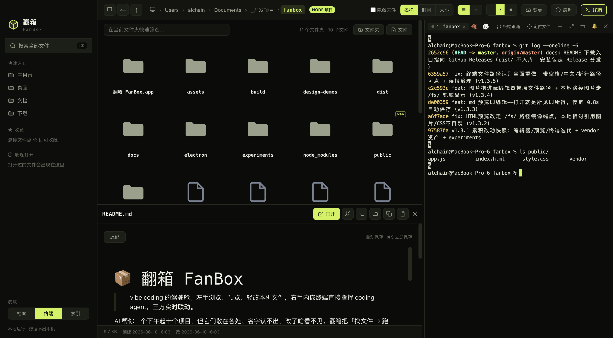
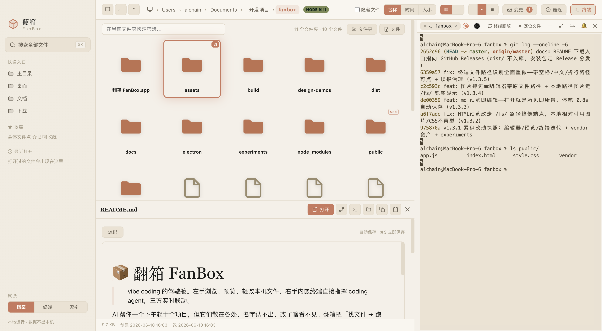

<div align="center">

# 📦 FanBox

> *"AI spins up ten projects in an afternoon. FanBox helps you find them again."*

[](LICENSE)
[](https://github.com/alchaincyf/fanbox/releases/latest)
[](https://github.com/alchaincyf/fanbox/releases/latest)
[](#architecture)

**English** · [简体中文](README.zh-CN.md)

<br>

**The cockpit for vibe coding: browse files on the left, command agents on the right, watch every change in between.**

<br>

Browse, preview and edit local files on one side; run Claude Code or any coding agent in a real embedded terminal on the other.<br>
Every time the agent writes a file, its card lights up — *find files → run agents → see what changed*, all in one window.

<br>

[⬇ Download dmg](https://github.com/alchaincyf/fanbox/releases/latest) · [Screenshots](#three-skins) · [Features](#what-it-does) · [Install](#install) · [Credits](#standing-on-the-shoulders-of-giants)

</div>

---

<p align="center">
  
</p>

<p align="center"><sub>▲ Real capture: browsing the fanbox repo itself, README previewed in place, git running in the embedded terminal. All screenshots in this README are taken from the live app via Playwright, unedited.</sub></p>

---

## Why FanBox

AI helps you start ten projects in an afternoon — then they scatter everywhere, the names stop making sense, and you can't see what got changed. The daily reality: dig through Finder → switch to iTerm to launch an agent → switch to the browser to check results. Three windows, endless hopping.

FanBox folds that loop into one window: **files on the left × terminal on the right/bottom × preview in place**. It doesn't compete with Finder on file ops or VS Code on editing. It does one chain well: *find → preview → light edits → command the agent*.

No cloud, no remote, no accounts. Local-first, zero config, zero runtime dependencies.

## Three skins

The UI was designed with [huashu-design](https://github.com/alchaincyf/huashu-design). The three skins are not theme-color swaps — palette, typography, icons, code highlighting and terminal ANSI themes all change together:

| | |
|---|---|
|  | **Volt** · neon green × charcoal × monospace, industrial instrument panel (default) |
|  | **Archive** · cream paper × terracotta × serif, a warm paper archive |
|  | **Index** · black & white × signal red/green × oversized type, editorial index daily |

## What it does

### Files · find & preview

- **⌘K global fuzzy search** — a fragment of the name is enough; `⌘↵` opens the project in your editor; `content:keyword` switches to full-text search.
- **Bold solid icons** — every file type "looks like itself": red PDFs, yellow JS, blue Markdown; photos and videos render at true aspect ratio.
- **Preview in place** — rendered Markdown, live HTML, syntax-highlighted code, inline images/video/PDF (HEIC included), archive content listing, checkerboard backing for transparent images.
- **Thumbnail speed** — scrolling and clicking through large folders stays under 0.1s.
- **Project badges** — folder cards show node / web / py / rs / go badges, so ten projects from one afternoon are recognizable at a glance.

### Watch what the agent changed

- **A live dashboard** — every file the agent writes makes its card ripple and glow by change frequency; the light follows wherever the agent goes.
- **Session replay** — drag the timeline like scrubbing a video to replay which files the agent touched, step by step.
- **Change inbox** — all files modified this session, aggregated across projects, for parallel agent runs.
- **Git diff** — Monaco read-only DiffEditor, HEAD vs working tree side by side.

### Agent cockpit

- **Project memory** — open any project folder and see what AI did there: past sessions (your first message as the title), the files each session changed, the skills it triggered — and a "resume" button that reconnects the context via `claude --resume` / `codex resume` in the embedded terminal.
- **Screenshot express** — take a system screenshot and a card pops up in the corner: feed it to the terminal agent, file it into the project's `素材/` (assets) folder, or annotate before sending.
- **AI organize** — AI proposes a cleanup plan from metadata only (it never reads content or touches the filesystem); you approve each move; FanBox executes with a rollback log and one-click undo. Engine selectable (Claude Code / Codex), strategy prompt fully editable.
- **Release wizard** — for node projects: version bump, CHANGELOG promotion, build, push and GitHub Release composed into one command sequence that runs visibly in the embedded terminal.
- **Skills X-ray** — every agent skill on your machine in one view: trigger statistics, health checks (description truncation, missing frontmatter), context budget, enable/disable without deleting.
- **Agent usage** — Claude Code official 5h window / weekly quota (same source as `/usage`) plus local token statistics; Codex window snapshots with reset detection.
- **Disk usage lens** — `du`-accurate bars per folder, drill-down, for the "my disk is full again" moments.

### Terminal · command the agent

- **A real embedded terminal** — node-pty + xterm.js (WebGL). Claude Code / vim / htop render correctly, CJK wide characters included.
- **Drag files in** — drop a file or folder into the terminal to insert its path as agent context.
- **Clickable paths** — file paths appearing in terminal output open in FanBox on click; macOS screenshot names with spaces, Chinese filenames and wrapped long paths are all recognized (space boundaries verified by stat, not guessed).
- **Send selection** — select text in a preview and fling it into the terminal with file provenance + fencing (bracketed paste, never executed line by line).
- **Situational awareness** — tab dots show running/idle/exited; when the agent hands the ball back, the terminal edge breathes; long tasks fire a system notification.

### Editing · WYSIWYG

- **Markdown** — Milkdown Crepe, Notion-style WYSIWYG; opens in edit mode, auto-saves 0.8s after you stop typing.
- **Code/JSON** — Monaco (the VS Code core), themed per skin.
- **Image annotation** — pen/arrow/text/redaction, format conversion, compression, resizing; overwriting the original asks first.
- **Unsaved guard** — all three editors intercept unsaved exits, including the Esc bypass.

## Install

### Desktop (recommended)

Download the latest `.dmg` from [**Releases**](https://github.com/alchaincyf/fanbox/releases/latest) and drag it into Applications. Native Apple Silicon (arm64).

> Signed with an Apple Development certificate + hardened runtime. If macOS warns about an unverified developer on first launch: **right-click → Open → confirm**.
>
> Built-in **update notifications**: when a new release lands on GitHub, a capsule appears at the bottom right. Never forced; individual versions can be muted.

### Web (no packaging)

```bash
node server.js
```

Open `http://localhost:4567`. Zero dependencies, zero build — clone and run. The web version covers browsing/search/preview (the embedded terminal and editors need Electron).

### Development

```bash
npm install
npm run app          # electron . — full desktop app
npm run dist         # build & sign the .dmg (output in dist/, distributed via Releases)
```

> If the Electron download is blocked: `ELECTRON_MIRROR="https://registry.npmmirror.com/-/binary/electron/" npm run dist`

## Shortcuts

| Action | Key | Action | Key |
|---|---|---|---|
| Global search | `⌘K` | Open in editor | `⌘↵` |
| Toggle sidebar | `⌘B` | Back | `⌘[` |
| Filter current folder | `/` | Open/preview | `↵` |
| Navigate results | `↑` `↓` | Close | `Esc` |

## Privacy & security

- The backend listens on loopback only and validates the Host header (anti DNS-rebinding). **Data never leaves your machine.**
- All frontend assets (including renderers and fonts) are vendored locally — no network requests at runtime, **fully usable offline**. The only outbound calls: the Claude usage API (optional) and the GitHub release check.
- HTML previews render in a sandboxed iframe with an opaque origin; an untrusted page can never reach terminal capabilities.
- Config writes are serialized read-modify-write with atomic persistence (temp + fsync + rename) — no data loss, no truncated JSON.
- Deletions go to the system Trash (recoverable); the thumbnail cache prunes oldest-first with a 400MB cap.

## Design & acceptance

The UI was designed with **[huashu-design](https://github.com/alchaincyf/huashu-design)** — skin direction exploration, component polish and anti-AI-slop review all come from its workflow. The icon is a terracotta archive box on a rice-paper squircle, generated from SVG all the way to icns.

Each development phase is reviewed by **5 independent subagents** playing different roles (heavy vibe coder / native-taste designer / zero-docs newcomer / ten-year terminal veteran / destructive QA), scoring the product + live screenshots + code. **Everything ships at ≥90 with zero red lines.** See `docs/05-验收角色与评分标准.md`.

## Standing on the shoulders of giants

FanBox's core capabilities come from these excellent open-source projects:

| Project | Used for | License |
|---|---|---|
| [Electron](https://www.electronjs.org/) | The desktop shell that gives a zero-dependency Node backend a real terminal and native powers | MIT |
| [node-pty](https://github.com/microsoft/node-pty) | The pseudo-terminal behind the embedded "real shell" | MIT |
| [xterm.js](https://xtermjs.org/) | Terminal rendering ([addon-webgl](https://github.com/xtermjs/xterm.js) GPU acceleration, addon-fit, addon-unicode11 for CJK) | MIT |
| [Monaco Editor](https://microsoft.github.io/monaco-editor/) | Code/JSON editing and Git diff view, the VS Code core | MIT |
| [Milkdown](https://milkdown.dev/) (Crepe) | Markdown WYSIWYG editing | MIT |
| [marked](https://marked.js.org/) | Markdown preview rendering | MIT |
| [highlight.js](https://highlightjs.org/) | Syntax highlighting | BSD-3-Clause |
| [esbuild](https://esbuild.github.io/) | Bundling Milkdown into a single local vendor file, keeping runtime no-build | MIT |
| [electron-builder](https://www.electron.build/) | Packaging and signing the dmg | MIT |
| [Playwright](https://playwright.dev/) | Driving Electron for README screenshots + UI verification | Apache-2.0 |

Every frontend dependency is vendored locally (`public/vendor/`) — that's what makes "fully usable offline" true, and it means each project above actually runs on your machine. Thank you.

## Architecture

| Layer | Stack |
|---|---|
| Backend | Zero-dependency Node.js `server.js` (file APIs + static serving + thumbnails) |
| Desktop shell | Electron 33 + node-pty (asarUnpack native module) |
| Terminal | xterm.js + WebGL + unicode11 |
| Editors | Monaco (code) + Milkdown Crepe (Markdown) |
| Packaging | electron-builder → signed arm64 .dmg |

<details>
<summary>Project layout</summary>

```
fanbox/
├── server.js               # Zero-dependency Node backend (file APIs + thumbnails + static)
├── electron/
│   ├── main.js             # Main process (window/pty/clipboard/fs.watch/menu)
│   └── preload.js          # Exposes fanboxPty / fanboxFs / fanboxClipboard
├── public/
│   ├── index.html
│   ├── style.css
│   ├── app.js              # Frontend single-page app
│   └── vendor/             # xterm / monaco / milkdown local assets
├── src-vendor/             # esbuild entries producing public/vendor/milkdown
├── build/                  # Icons + entitlements
├── docs/                   # Concepts/PRD/roadmap/acceptance criteria
└── experiments/            # Experiment scripts (incl. README screenshot script)
```

</details>

## Author

**Huashu (花叔)** — AI Native Coder, indie developer. Known for Cat Light (App Store paid chart Top 1).

| Platform | Link |
|------|------|
| 🌐 Web | [bookai.top](https://bookai.top) · [huasheng.ai](https://www.huasheng.ai) |
| 𝕏 Twitter | [@AlchainHust](https://x.com/AlchainHust) |
| 📺 Bilibili | [花叔](https://space.bilibili.com/14097567) |
| 📕 Xiaohongshu | [花叔](https://www.xiaohongshu.com/user/profile/5abc6f17e8ac2b109179dfdf) |
| 💬 WeChat | Search "花叔" |

More AI creations: [Nuwa.skill](https://github.com/alchaincyf/nuwa-skill) (distill anyone's way of thinking) · [huashu-design](https://github.com/alchaincyf/huashu-design) (a deliverable design from one sentence)

---

<div align="center">

**Finder** manages your files.<br>
**IDEs** write your code.<br>
**FanBox** shows you what AI did on your machine.<br><br>

MIT License © [Huashu](https://github.com/alchaincyf)

</div>
